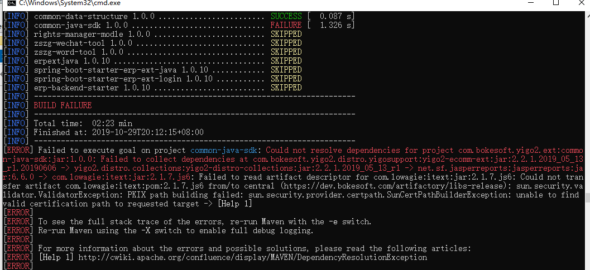

## JDK-PKIX-SOLVER说明数
### 目的
该工程的目就是为jdk添加域名的授信,例如在使用`maven`打包时,有时会出现下面的错误

主要就是`PKIX:PKIX path building failed: sun.security.provider.certpath.SunCertPathBuilderException: unable to find valid certification path to requested target`,大意就是`jdk`没有该域名的安全授信证书,所以不给下载

### 解决方案
参考资料: https://blog.csdn.net/faye0412/article/details/6883879
通过参考资料,结合了spring-boot的便利性,制作快速添加授信证书的`jar`

### 使用方法
```shell
java -jar jdk-pkix-solver-*.jar {添加的域名} {口令} {是否强制}
```
如：
- 简单模式
```shell
java -jar jdk-pkix-solver-1.0.0.jar repo.maven.apache.org
```
- 修改口令模式
```shell
java -jar jdk-pkix-solver-1.0.0.jar repo.maven.apache.org changeit
```
- 强制模式
```shell
java -jar jdk-pkix-solver-1.0.0.jar repo.maven.apache.org changeit true
```